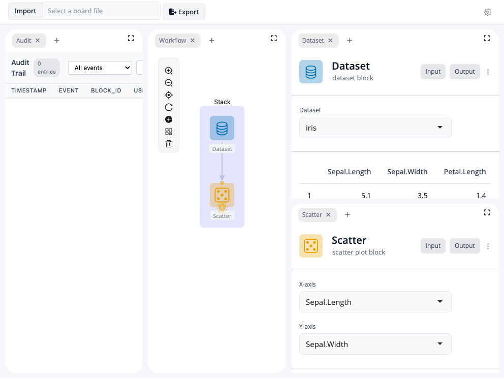
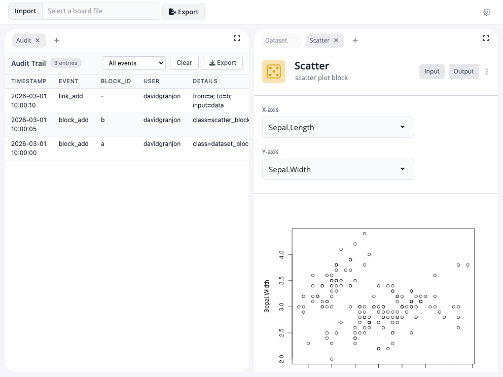

<!-- README.md is generated from README.Rmd. Please edit that file -->

```{r, include = FALSE}
knitr::opts_chunk$set(
  collapse = TRUE,
  comment = "#>",
  fig.path = "man/figures/README-",
  out.width = "100%"
)
```

# blockr.audit

<!-- badges: start -->
[](https://lifecycle.r-lib.org/articles/stages.html#experimental)
<!-- badges: end -->

The goal of blockr.audit is to provide an audit trail extension for `blockr.core`. It records board operations (block additions/removals, link changes, parameter updates, errors) with timestamps and provenance metadata. The trail can be viewed as a log table, exported for compliance reporting, and optionally restored across sessions.

## Installation

You can install the development version of blockr.audit like so:

```r
pak::pak("BristolMyersSquibb/blockr.audit")
```

## Basic example

To start up a basic board with audit trail:

```{r basic-example, eval=FALSE, code=readLines("inst/examples/basic/app.R")}
```

```{r, echo=FALSE, message=FALSE, warning=FALSE}
code_lines <- knitr::knit_code$get("basic-example")
app <- eval(parse(text = code_lines))
webshot2::appshot(app, "man/figures/basic-app.png")
```



## Restoring a previous audit log

You can restore an audit log from a previous session:

```{r restore-example, eval=FALSE, code=readLines("inst/examples/restore/app.R")}
```

```{r, echo=FALSE, message=FALSE, warning=FALSE}
code_lines <- knitr::knit_code$get("restore-example")
app <- eval(parse(text = code_lines))
webshot2::appshot(app, "man/figures/restore-app.png")
```


